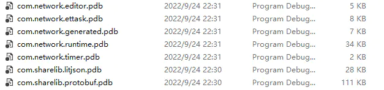

# ET-Network-Module

这是一个从 ET 6.0 中梳理出来的多次重构了的，使用  asmdef 模块化了的网络模块

在这个模块中，已经没有了 ET Entity 的概念，也没有 ECS 各种跳跃式的分工程开发模式，一切又回到了常规的 Unity 开发，绝对符合你的开发习惯与直觉。

当然，该模块底层必然可以与 ET Server 通信的网络模块，但仅保留 TCP 协议的 TServer TChannel，其他可自行移植与扩展（ET6.0 KCP 实际也是使用的 TServer 套件）。

同时，为了更好的在 MonoBehaviours 脚本中使用 ，非 RPC 网络消息的 MessageHandler 的工作流也做了相应的改进。

首先，我们简化了事件的监听与取消订阅，使用如下方式即可获取关心的网络消息：

使用：``MessageHandlerCenter.ListenSignal``监听关心的非 RPC 网络消息

使用：`MessageHandlerCenter.RemoveSignal`删除对指定网络消息的监听

```
using ET;
using UnityEngine;
using static MessageHandlerCenter;
public class HandlerUsageCase : MonoBehaviour
{
    private void Start()
    {
        ListenSignal<M2C_CreateMyUnit>(OnMyUnitCreated);
    }
    private void OnMyUnitCreated(Session arg1, M2C_CreateMyUnit arg2)
    {
        // 撰写你自己的逻辑
    }
    private void OnDestroy()
    {
        RemoveSignal<M2C_CreateMyUnit>(OnMyUnitCreated);
    }
}
```

其次，我们自动分析并生成非 RPC 网络消息的处理器，工具截图如下：


生成的这些 Handler 文件会使用一个单独的程序集管理，减小编译时长

提供根据 .proto 生成 .cs 消息实体类的工具，前后端完全可以通过 .proto 文件对协议而不需要交换 .cs 文件。


生成的实体类与 handler 同位于 Generated 文件夹


动图演示的是消息类以及非 rpc 消息处理器代码生成


通过 assemly definition file 对各个模块进行了依赖的拆分，Generated 文件夹随时可一键更新，下图可见拆分后的模组结构：




PS：为了方便测试，预置了 ET6.0 Server （删除了非必要组件），通过菜单栏：Tools/Start Test Server 开启。

演示连接 Gate 服务器、登录服务器、心跳（Ping）、进入map


